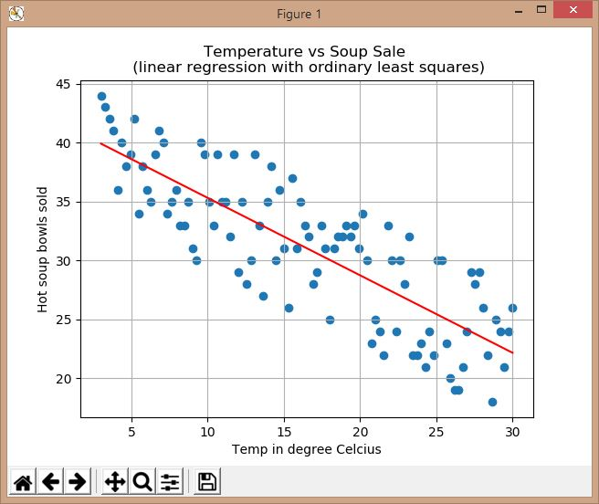
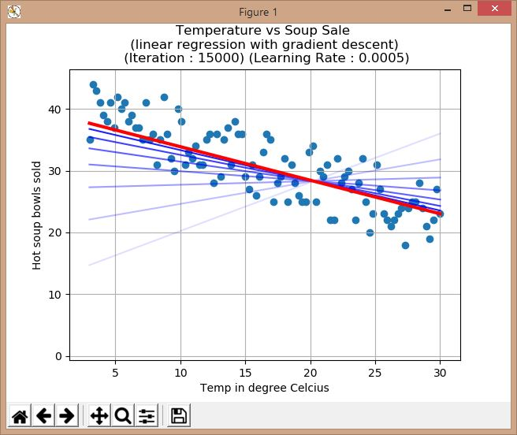
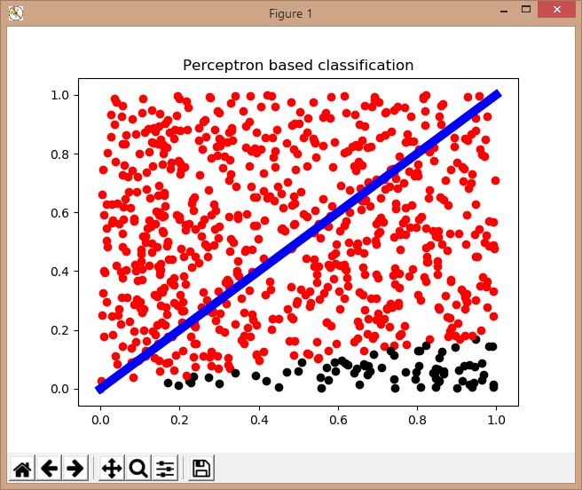
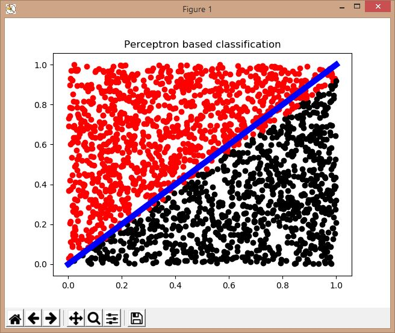
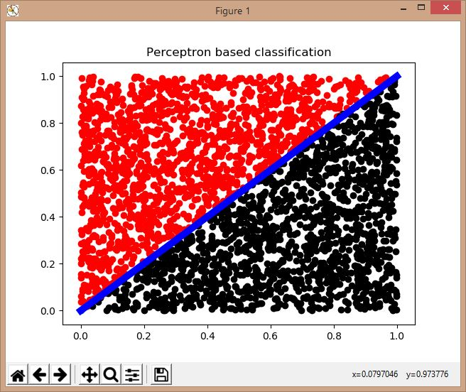

# Learning Machine Learning
<i>Pun fully intended. #NO_REGRETS  </i> 

I have previously created and used Artificial Neural Networks(ANN) with the help
of the MATLAB System Identification (essentially for regression) for
training an ANN on simulation data of UAV landing gear shock absorbtion and
suspension characteristics when rolling over different kind of runways and under
multiple simulated base excitations.

### So.
I want to break apart the Machine Learning(ML) algorithms and understand them. 
Moreover, we have so much amazing AI and ML toolboxes such as Tensorflow, Keras,
scikit-learn that many people are able to create amazing things. However at the
expense of not fully understanding the concepts involved in such libraries and
hence not able to essentialy create optimised solutions for the problems that
they are trying to solve. 

Enough said. Let's get coding.

## Author : Sayan Bhattacharjee
## Email  : aero.sayan@gmail.com

### Contents
ML is vast. And I do not want to pollute my github repo with learning material.
So all ML related learning and practice code will be in this repo.
And they are...
+ src/01_soup_sale.py : Linear regression using ordinary least square
	- Winter season temperature vs hot soup sale. Yum!
	- We fit a line through the data points using linear regresion.
	- RESULT   
	- More images in images/ folder.
+ src/02_soup_sale_gradient_descent.py : Linear regerssion with gradient descent
	- Winter season temperature vs total soup sale.
	- We do linear regression using gradient descent algorithm
	- We used a constant learning rate, which is good but needs to made variable.
	- RESULT   
	- The blue transparent lines indicate the position of the line when in training.
	- The red opaque line indicate the final line created after completion of iterations
	- More images in images/ folder.
+ src/03_perceptron.py : It's a freaking perceptron based classifier !! (Kyaaah!!! XD)
	- We made a red ball black ball classifier using a perceptron.
	- A perceptron is basically an Aritficial Neural Network with one neuron.
	- What you think it's simple,so it is not important?
		- My silly friend. This is the powerhouse that can be scaled up to tremendous levels.
	- Any thing above the blue line is supposed to be red(+1) and all that is below is to be black(-1)
	- We train our perceptron on 100x8 , 100x10 and 100x30 data points using supervised learning.
	- The training essentialy modifies the weights of the perceptron.
	- Then we call it to guess and classify the data points and we plot it
	- RESULTS for 100*8 data points   
	- It can be seen the classification failed miserably! It is because, we did not have enough data points.
	- RESULTS for 100*10 data points   
	- We can see the results improved , but still some balls are not classified correctly
	- RESULTS for 100*30 data points   
	- The final one is just pure bliss !! Waaaaaah !!! XD
